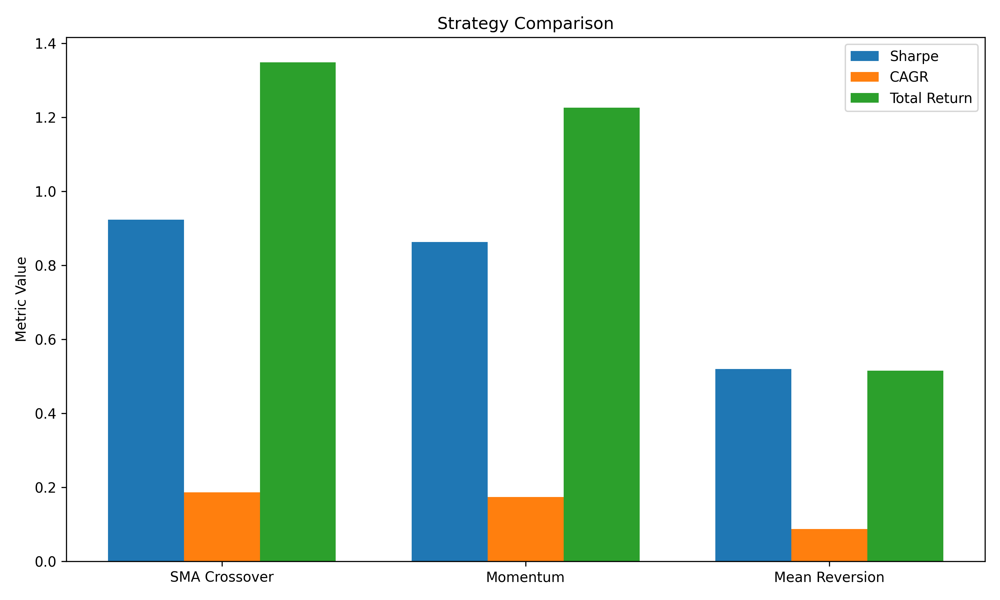
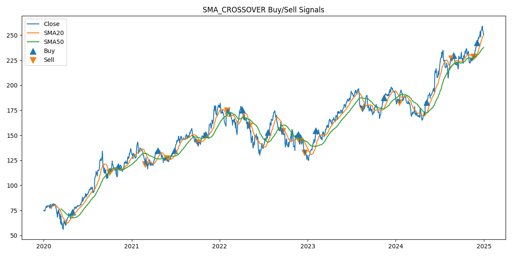
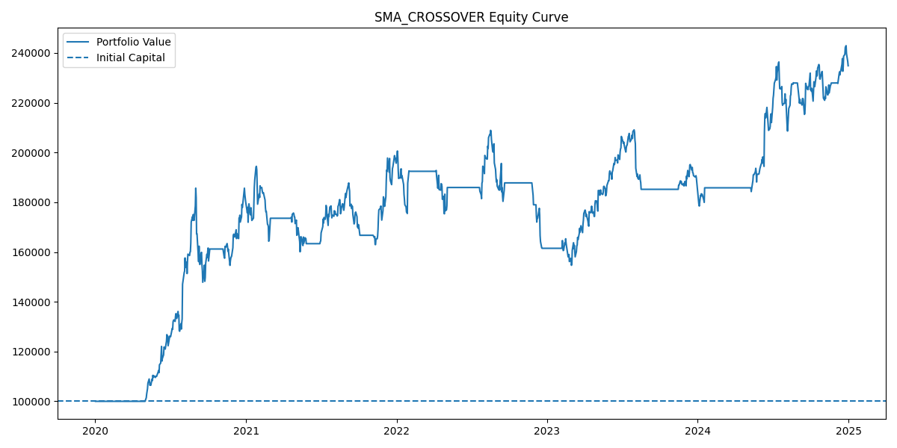
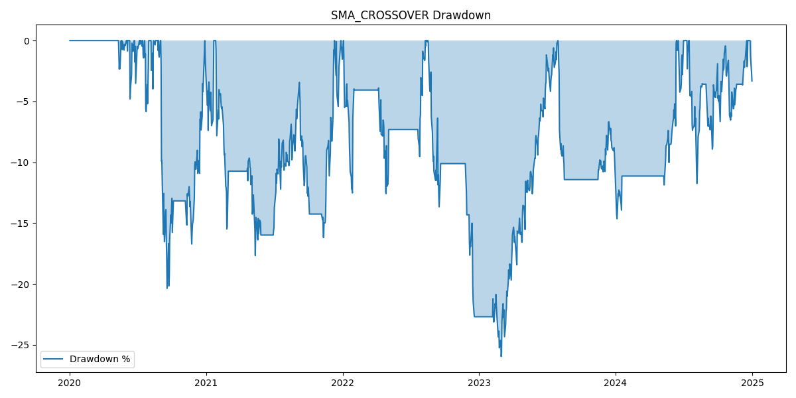
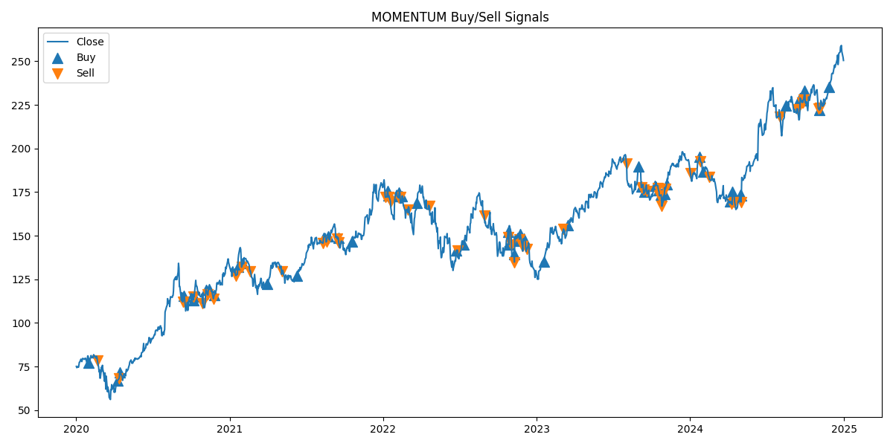
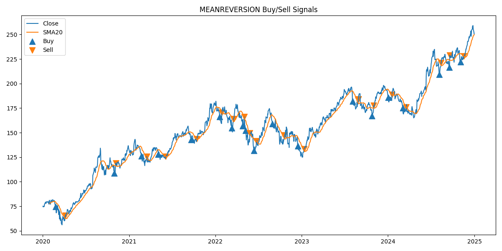
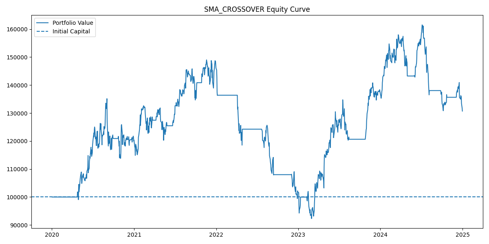
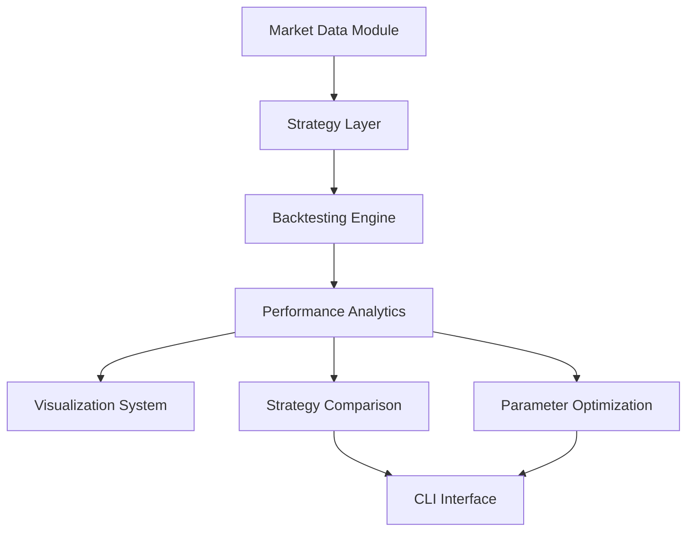

# Quantitative Research & Backtesting Framework

A Python-based quantitative research and backtesting framework for developing, evaluating, comparing, and optimizing systematic trading strategies using historical market data.

The framework simulates a simplified quantitative research workflow similar to those used by hedge funds, proprietary trading firms, and quantitative analysts.

---

## Key Results

### Best Performing Strategy (AAPL)

| Metric | Value |
|---------|---------:|
| Strategy | SMA Crossover (20/50) |
| Total Return | 134.87% |
| CAGR | 18.67% |
| Sharpe Ratio | 0.92 |
| Sortino Ratio | 1.06 |
| Max Drawdown | 25.97% |
| Win Rate | 64.29% |
| Profit Factor | 4.14 |
| Number of Trades | 14 |

### Project Statistics

| Metric | Value |
|----------|--------:|
| Automated Tests | 102 |
| Test Pass Rate | 100% |
| Code Coverage | 80% |
| Strategies Implemented | 3 |
| Optimization Support | Yes |
| Visualization Support | Yes |
| CLI Interface | Yes |

---

# What is Quantitative Research?

Quantitative research uses historical market data, systematic trading rules, and statistical analysis to evaluate investment strategies before deploying capital in live markets.

Instead of relying on subjective decisions, quantitative strategies use predefined rules that can be tested objectively on historical data.

This project demonstrates the complete quantitative research workflow:

```text
Market Data
    ↓
Strategy Development
    ↓
Signal Generation
    ↓
Backtesting
    ↓
Performance Analysis
    ↓
Optimization
    ↓
Strategy Comparison
```

---

# Features

## Market Data Module

✔ Historical market data download using Yahoo Finance

✔ Multi-ticker support

✔ Data validation

✔ Missing value handling

✔ Duplicate date detection

✔ Invalid ticker handling

Supported examples:

```text
AAPL
MSFT
SPY
RELIANCE.NS
```

---

## Strategy Framework

All strategies inherit from a common abstract base class.

```python
class BaseStrategy(ABC):

    @abstractmethod
    def generate_signals(self, data):
        pass
```

Benefits:

- Consistent interface
- Extensible design
- Plug-and-play strategy integration
- Easy addition of new strategies

---

# Implemented Strategies

## 1. SMA Crossover Strategy

### Logic

Generate a long signal when:

```text
Fast SMA > Slow SMA
```

Example:

```text
SMA20 > SMA50
```

Features:

- Trend-following approach
- Reduced market noise
- Long-only implementation

---

## 2. Momentum Strategy

### Momentum Definition

```text
Momentum =
Close / Close.shift(n) - 1
```

### Signal Generation

```text
Long when:

Momentum > 0
```

Features:

- Captures market trends
- Reacts quickly to directional moves
- Higher trade frequency

---

## 3. Mean Reversion Strategy

Uses rolling Z-Score analysis.

### Formula

```text
ZScore =
(Close - SMA)
/
Rolling Standard Deviation
```

### Entry

```text
ZScore < Entry Threshold
```

### Exit

```text
ZScore >= Exit Threshold
```

Default parameters:

```python
lookback_period = 20
entry_threshold = -2.0
exit_threshold = 0.0
```

Features:

- Statistical arbitrage style logic
- Exploits short-term price deviations
- Lower return, higher win rate profile

---

# Backtesting Engine

The framework includes a fully functional event-driven backtesting engine.

## Features

- Next-bar execution
- Position sizing controls
- Transaction cost modeling
- Trade tracking
- Equity curve generation
- Daily return calculation
- Drawdown analysis

---

## Position Sizing

Configurable through environment variables:

```env
POSITION_SIZE=0.25
POSITION_SIZE=0.50
POSITION_SIZE=1.00
```

Capital allocation:

```text
Allocated Capital =
Portfolio Value × Position Size
```

---

## Transaction Costs

Configurable:

```env
TRANSACTION_COST=0.001
```

Applied on:

- Trade entry
- Trade exit

---

## Trade Tracking

Every completed trade records:

```text
Entry Date
Exit Date
Entry Price
Exit Price
Shares
Trade PnL
Gross Return
Net Return
Holding Period
```

---

# Performance Analytics

The framework evaluates strategies using professional quantitative performance metrics.

| Metric | Description |
|----------|-------------|
| Total Return | Overall portfolio growth |
| CAGR | Annualized return |
| Volatility | Annualized risk |
| Sharpe Ratio | Risk-adjusted return |
| Sortino Ratio | Downside-adjusted return |
| Max Drawdown | Largest historical loss |
| Win Rate | Percentage of profitable trades |
| Profit Factor | Gross Profit / Gross Loss |
| Number of Trades | Total completed trades |

---

# Example Backtest Result

### Asset

```text
AAPL
```

### Strategy

```text
SMA Crossover (20 / 50)
```

### Period

```text
2020-01-01 → 2025-01-01
```

| Metric | Value |
|----------|---------:|
| Total Return | 134.87% |
| CAGR | 18.67% |
| Volatility | 20.87% |
| Sharpe Ratio | 0.92 |
| Sortino Ratio | 1.06 |
| Max Drawdown | 25.97% |
| Win Rate | 64.29% |
| Profit Factor | 4.14 |
| Number of Trades | 14 |

---

# Strategy Comparison

Comparison performed on AAPL from 2020–2025.

| Rank | Strategy | Total Return | CAGR | Sharpe | Sortino | Max Drawdown | Win Rate | Trades |
|------|----------|-------------:|------:|--------:|---------:|-------------:|---------:|--------:|
| 1 | SMA Crossover | 134.87% | 18.67% | 0.92 | 1.06 | 25.97% | 64.29% | 14 |
| 2 | Momentum | 122.57% | 17.40% | 0.86 | 1.05 | 26.22% | 38.89% | 54 |
| 3 | Mean Reversion | 51.48% | 8.68% | 0.52 | 0.31 | 25.89% | 68.42% | 19 |

The framework automatically ranks strategies based on Sharpe Ratio.

---

# Parameter Optimization

The framework supports parameter optimization workflows.

Current implementation:

```text
SMA Crossover Optimization
```

### Optimization Results

| Rank | Fast MA | Slow MA | Total Return | CAGR | Sharpe | Max Drawdown | Trades |
|------|---------|---------|-------------:|------:|--------:|-------------:|--------:|
| 1 | 20 | 50 | 134.87% | 18.67% | 0.92 | 25.97% | 14 |
| 2 | 10 | 30 | 79.69% | 12.47% | 0.67 | 29.57% | 22 |
| 3 | 50 | 200 | 56.18% | 9.35% | 0.55 | 24.54% | 4 |

Best Parameters:

```python
{
    "fast_window": 20,
    "slow_window": 50
}
```

---

# Cross Asset Validation

The framework can be evaluated on multiple assets.

Example:

### MSFT SMA Crossover

| Metric | Value |
|----------|---------:|
| Total Return | 30.70% |
| CAGR | 5.51% |
| Sharpe Ratio | 0.37 |
| Sortino Ratio | 0.43 |
| Max Drawdown | 38.05% |
| Win Rate | 33.33% |
| Number of Trades | 15 |

---

# Visualization System

Charts are automatically generated and saved to:

```text
outputs/charts/
```

Generated charts include:

- Trading Signals
- Equity Curves
- Drawdown Curves

---

# Results

## Strategy Comparison



## SMA Crossover Signals



## SMA Equity Curve



## SMA Drawdown



## Momentum Signals



## Mean Reversion Signals



## MSFT Cross-Asset Example



---

# System Architecture



---

# Project Structure

```text
quant-backtester/
│
├── cli/
│   ├── commands.py
│   └── registry.py
│
├── data/
│   └── downloader.py
│
├── metrics/
│   └── performance.py
│
├── optimization/
│   └── optimizer.py
│
├── reports/
│   └── comparison.py
│
├── strategies/
│   ├── base_strategy.py
│   ├── sma_crossover.py
│   ├── momentum.py
│   └── mean_reversion.py
│
├── tests/
│
├── visualizations/
│   └── plots.py
│
├── outputs/
│   ├── charts/
│   ├── logs/
│   └── reports/
│
├── backtester.py
├── config.py
├── main.py
├── requirements.txt
└── README.md
```

---

# Installation

Clone the repository:

```bash
git clone https://github.com/yourusername/quant-backtester.git
cd quant-backtester
```

Create a virtual environment:

```bash
python -m venv venv
```

Activate environment:

### Windows

```bash
venv\Scripts\activate
```

### Linux / macOS

```bash
source venv/bin/activate
```

Install dependencies:

```bash
pip install -r requirements.txt
```

---

# Configuration

Example `.env`

```env
TICKERS=AAPL,MSFT,SPY

START_DATE=2020-01-01
END_DATE=2025-01-01

INITIAL_CAPITAL=100000

TRANSACTION_COST=0.001

POSITION_SIZE=1.0
```

---

# Command Line Interface

Run default strategy:

```bash
python main.py
```

Run SMA strategy:

```bash
python main.py --strategy sma
```

Run Momentum strategy:

```bash
python main.py --strategy momentum
```

Run Mean Reversion strategy:

```bash
python main.py --strategy mean_reversion
```

Run on a specific ticker:

```bash
python main.py --ticker MSFT
```

Compare strategies:

```bash
python main.py --compare
```

Optimize SMA parameters:

```bash
python main.py --optimize
```

List available strategies:

```bash
python main.py --list-strategies
```

Show version:

```bash
python main.py --version
```

---

# Testing

The project includes a comprehensive automated test suite.

### Current Status

| Metric | Value |
|----------|-------:|
| Passing Tests | 102 |
| Failed Tests | 0 |
| Pass Rate | 100% |
| Coverage | 80% |

Coverage includes:

- Market Data Module
- Strategy Framework
- SMA Strategy
- Momentum Strategy
- Mean Reversion Strategy
- Backtesting Engine
- Performance Analytics
- Visualization System
- Optimization Engine
- CLI Commands

Run tests:

```bash
pytest
```

Run coverage:

```bash
pytest --cov=. --cov-report=term-missing
```

---

# Future Roadmap

Planned enhancements:

- Multi-Asset Portfolio Backtesting
- Walk-Forward Optimization
- Benchmark Comparison
- Monte Carlo Simulation
- RSI Strategy
- MACD Strategy
- Bollinger Bands Strategy
- Portfolio Allocation Models
- Database-Backed Data Storage
- Data Caching Layer
- Interactive Dashboard
- Web Application Interface
- Live Trading Integration

---

# Disclaimer

This project is intended solely for educational and research purposes.

Nothing in this repository should be considered financial advice, investment advice, or a recommendation to buy or sell any financial instrument.

Past performance does not guarantee future results.

---

# License

Released under the MIT License.
